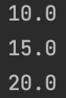
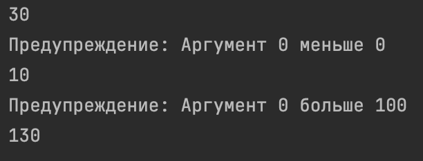

# Python. Лабораторная работа №4

# Условие задач: Замыкание для поиска среднего в аргументах.
## Описание проделанной работы: Функция make_averager создает замыкание, которое сохраняет состояние и возвращает среднее значение всех переданных чисел при каждом вызове.
## Скриншоты результатов:

# Условие задач: Декоратор для проверки аргументов функции на тип и диапазон значений.
## Описание проделанной работы: Декоратор validate_args проверяет типы и диапазоны значений переданных аргументов функции, выводя предупреждения при несоответствии, и затем выполняет функцию с этими аргументами.
## Скриншоты результатов:

## Ссылки на используемые материалы:
[Документация Python](https://www.python.org/doc/)

[Декораторы Python](https://habr.com/ru/companies/otus/articles/727590/)

[Замыкания в Python](https://habr.com/ru/articles/862692/)
